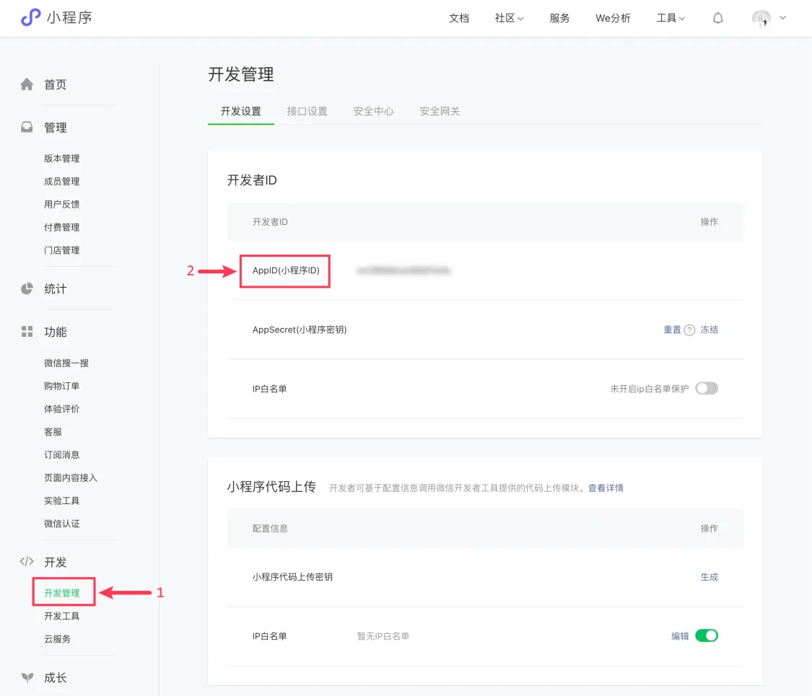

## 1. 查看 AppID

- 在微信公众平台上查找自己的小程序 AppID，该 ID 在创建新的小程序项目时必需填写。
- https://mp.weixin.qq.com/
  - 微信公众平台
- 查阅流程：
  1. 进入微信公众平台，完成登录。
  2. 在【开发】->【开发管理】->【开发设置】下面能够找到自己的 AppID。
     - 
     - **需要清楚知道这个 AppID 在什么地方查看。我们每次创建小程序项目的时候，都需要填写这个 AppID。**
